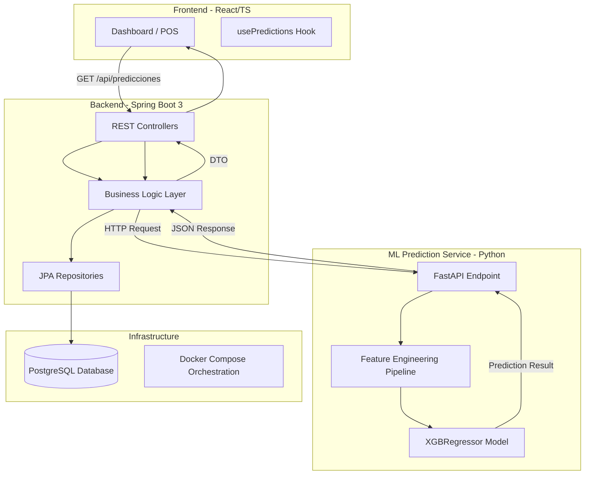

# SmartPOS: Arquitectura y Comunicación de Microservicios

Este documento describe la interacción técnica entre los componentes del sistema para lograr una administración inteligente y predictiva.

## 🏗️ Diagrama de Arquitectura (C4 - L2)

## 🧠 Flujo de Datos de Machine Learning (ML Pipeline)

1. **Extracción (ETL):** El servicio de ML extrae el historial de ventas desde PostgreSQL.
2. **Feature Engineering:**
    - Transformación de fechas a ciclos armónicos (seno/coseno).
    - Inyección de variables climáticas externas.
    - Cálculo de métricas de inventario (Stock Ratio, Reorder Point).
3. **Inferencia:** El modelo XGBRegressor calcula el volumen de compra recomendado para evitar *stock-outs*.
4. **Entrega:** La predicción se envía al backend de Java para ser consumida por el módulo de compras del POS.

## 🐳 Infraestructura de Contenedores

| Contenedor | Tecnología | Responsabilidad |
| :--- | :--- | :--- |
| `smartpos-api` | Java 17 | Lógica de negocio, seguridad y persistencia. |
| `smartpos-ui` | React 18 | Interfaz de usuario y visualización de datos. |
| `smartpos-ml` | Python 3.9 | Inferencia predictiva con XGBoost. |
| `smartpos-db` | PostgreSQL | Almacenamiento relacional de datos. |
